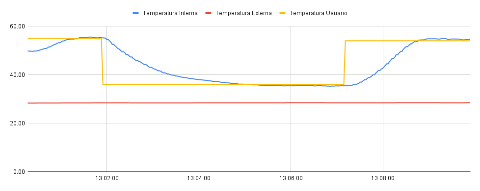
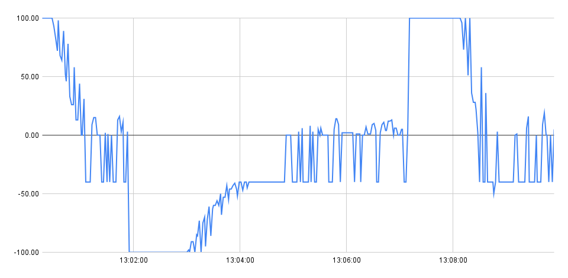

# Trabalho 1 - FSE

## Desrição

Esse trabalho tem como objetivo simular um sistema de controle de um forno para soldagem de placas de circuito impresso. Mais detalhes desse trabalho pode ser observado em seu enunciado conforme o link abaixo.

Descrição do trabalho: https://gitlab.com/fse_fga/trabalhos-2021_2/trabalho-1-2021-2.

## Compilação

Na pasta raiz do repositório, utilize make para compilar e make run para executar

## Uso

- Ao iniciar o programa, será solicitada a configuração dos parâmetros **Ki**, **Kp** e **Kd** para ser usado para o controle de temperatura através do PID.   

- O programa aguarda o sistema ser ligado

- Após ligar o sistema, o usuário poderá escolher uma opção do menu, sendo elas
    
    - **Parâmetros**: O usuário poderá verificar os parâmetros que serão utilizados no controle PID, Além disso, poderá alterar esses parâmetros.

    - **Definir temperatura de referência**: O usuário pode indicar uma temperatura pelo modo terminal

    - **Potenciometro/Curva Reflow**: O sistema irá iniciar o controle de temperatura pelo modo potenciômetro, permitindo que o usuário altere para o modo de curva reflow.

- Quando o sistema é desligado, o programa volta para o estado de espera para o sistema ser ligado novamente. 

## Experimentos

### Potenciômetro

### Curva Reflow

